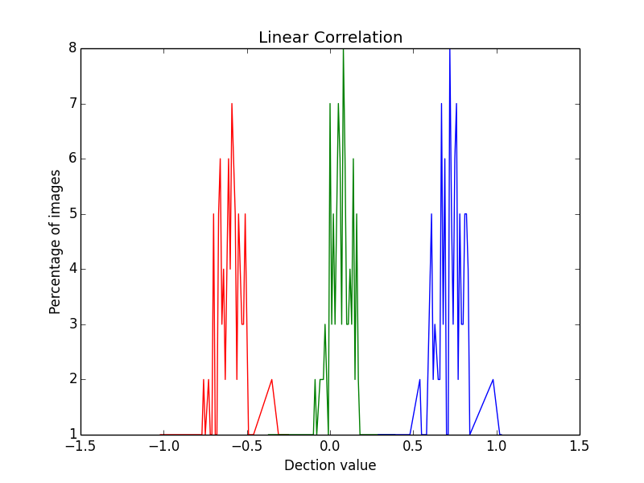
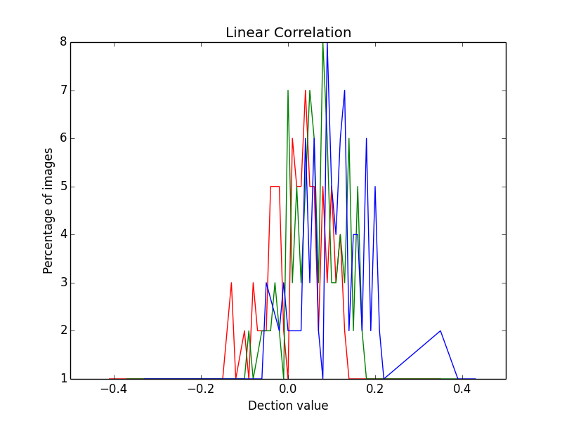
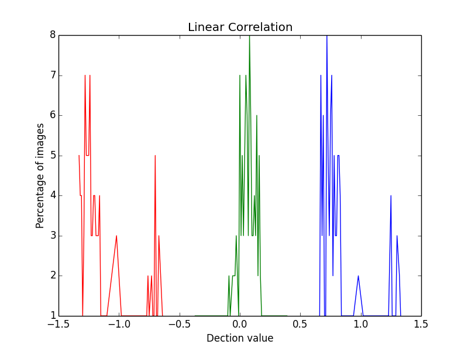

#Hw_3
##Linear Correlation 

###需求:  
1. 請根據講義 ch03_elg7173 的 11-12 頁之演算法實作 blind detection, 同時使用以下三種隱藏方法對所有實驗影像分別隱藏 0、1 以及不藏,進行 linear correlation 偵測並呈現其結果。不限定程式語言。演算法中使用的參數請 自行調整(𝛂、𝒘𝒓以及 n)。
	
	A. Blind embedding(3-6 頁,別忘了還要加上 n)
	
	B. 將 blind embedding 所用的 𝒘𝒓 經過 low pass filter 處理後取代。

	C. Improving blind embedding(17-18 頁)
程式輸入:所有的灰階影像、隱藏的資訊(secret bit)、演算法相關參數( parameters)

###實作問題：
1. 	最初以為linear detection 要去掉c0結果影響輸出的結果範圍太大，次數不集中或特別集中在某數值。還有low-pass filter以為邊緣的點只需要除上有值的部分，後來會影響邊緣filter的值有差，如除上9跟除4的值的差距。
2. Alpha在imprve算出來之後如果是用round不是用ceil有可能0.5以下就被捨棄，wm隱藏就沒有意義。
###實作結果：

